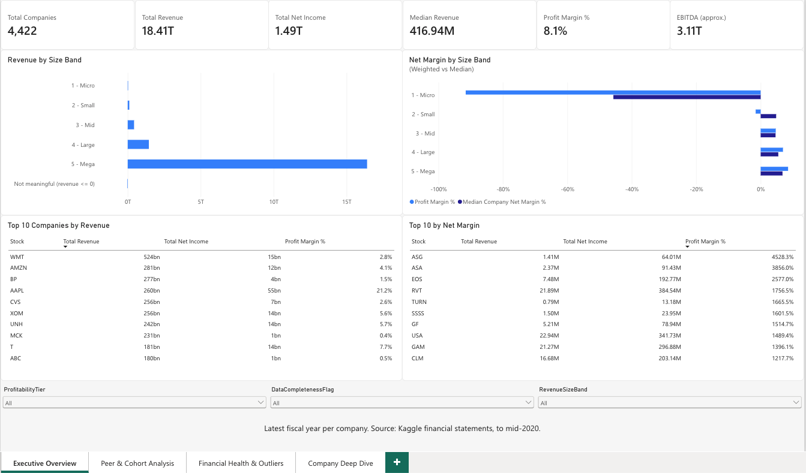
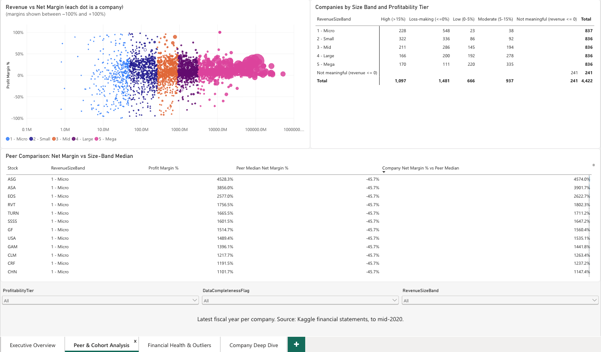
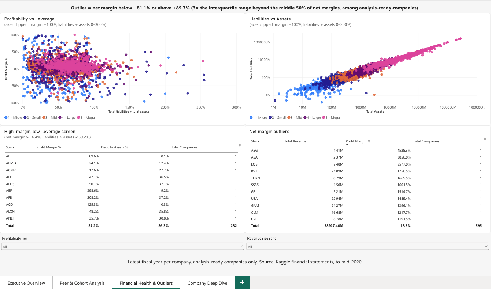
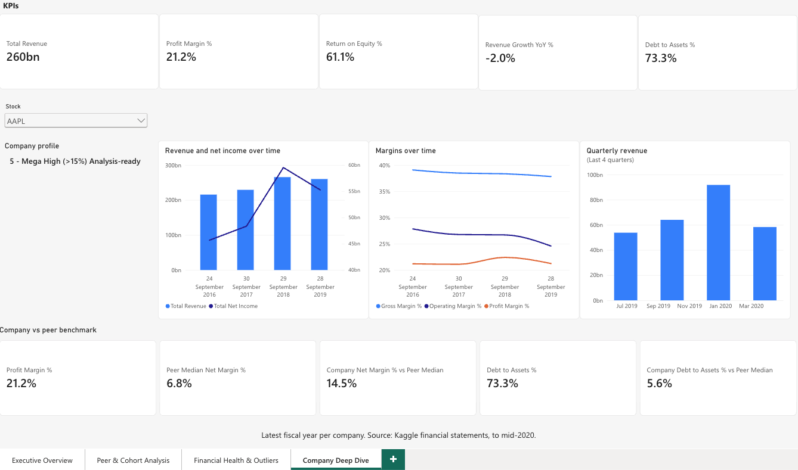
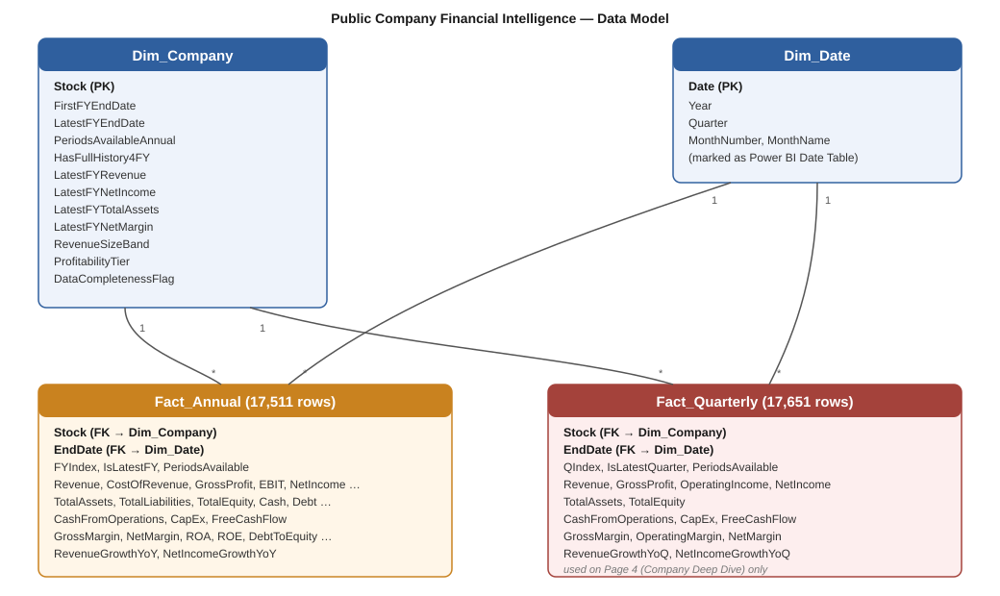

# Public Company Financial Intelligence Dashboard

A Power BI report built from the reported income statements, balance sheets and cash-flow statements of **4,422 public companies (fiscal years through mid-2020)**. It help to size the company universe, benchmark a company against peers of similar size, surface financially unusual companies with a transparent rule, and inspect any single company over its available fiscal years.

## Objective

Give an analyst three things from statement data : 
(1) a fast read on the size and health of the company universe, 
(2) a way to benchmark one company against comparably sized peers, and 
(3) a documented, quantitative rule for flagging unusual margins without labelling them "bad".

## Dataset

[**Financial Data of 4400 Public Companies**](https://www.kaggle.com/datasets/qks1lver/financial-data-of-4400-public-companies) by `qks1lver` on Kaggle. This project does not own or redistribute the data; see [`data/raw/README.md`](data/raw/README.md) for how to obtain it. Six CSVs (annual and quarterly income statement, balance sheet, cash flow): 17,511 annual and 17,651 quarterly company-period rows, files dated 14 Jun 2020.

## Tech stack

- **Power BI** (Power Query, semantic model, DAX, report design), built in the Power BI service; the report file is [`powerbi/Public_Company_Financial_Intelligence.pbix`](powerbi/Public_Company_Financial_Intelligence.pbix)
- **Python** (pandas, numpy): dataset audit, cleaning/modelling pipeline, and reproducible reference values for checking the report
- **SQL**: reference queries mirroring the DAX logic ([`sql/analysis_queries.sql`](sql/analysis_queries.sql); no live database is part of the project)
- **Git/GitHub**

## Dashboard

### Executive Overview
Universe size, aggregate and median revenue, margin by size cohort, largest companies.



### Peer & Cohort Analysis
Revenue vs. net margin for every company, cohort composition, and each company's margin against the median of its size-band peers.



### Financial Health & Outliers
Profitability vs. leverage, liabilities vs. assets, a high-margin/low-leverage screen, and net-margin outliers under a stated 3×IQR rule.



### Company Deep Dive
Pick a company: latest-year KPIs, multi-year revenue, net income and margin trends, quarterly revenue, and variance from its peer cohort.



## Key features

- KPI cards driven by DAX measures with guarded ratios
- Peer-cohort benchmarking: company net margin and liabilities-to-assets versus the median of its revenue-size band
- Transparent outlier rule: net margin beyond the 3×IQR fences (−81.1% / +89.7%) among analysis-ready companies
- Single-company deep dive over up to four fiscal years plus the last four quarters
- Slicers for revenue-size band, profitability tier and data completeness
- Chart axes that are clipped or log-scaled are labelled as such on the chart

## Data model

A small star schema: two fact tables at different grains (`fact_annual`, `fact_quarterly`) sharing one `dim_company` and one `Dim_Date`, all single-direction one-to-many relationships. Year-over-year growth uses a per-company fiscal-period index rather than standard time-intelligence, because fiscal year-ends are not aligned across companies. See [`docs/DATA_MODEL.md`](docs/DATA_MODEL.md).



## DAX (representative measures)

```DAX
Total Revenue =
SUM ( fact_annual[TotalRevenue] )

Profit Margin % =
IF ( [Total Revenue] > 0, DIVIDE ( [Total Net Income], [Total Revenue] ) )

Return on Equity % =
DIVIDE (
    CALCULATE ( [Total Net Income], fact_annual[TotalEquity] > 0 ),
    CALCULATE ( [Total Equity], fact_annual[TotalEquity] > 0 )
)
-- negative-equity rows (1,410) excluded from both numerator and denominator

Peer Median Net Margin % =
VAR PeerBand = SELECTEDVALUE ( dim_company[RevenueSizeBand] )
RETURN
    IF (
        NOT ISBLANK ( PeerBand ),
        CALCULATE (
            [Median Company Net Margin %],
            REMOVEFILTERS ( dim_company[Stock] ),
            dim_company[RevenueSizeBand] = PeerBand
        )
    )
```

All measures, with business meaning, assumptions and edge cases, are in [`docs/DAX_MEASURES.md`](docs/DAX_MEASURES.md).

## Business insights

All figures use each company's latest fiscal year and were recomputed independently in Python ([`python/dashboard_reference_values.py`](python/dashboard_reference_values.py)).

- The top revenue-size quintile (836 of 4,422 companies) accounts for **89.1%** of aggregate revenue.
- Median year-over-year revenue growth is **+4.8%**.
- Company size and net margin are only weakly related (correlation of log-revenue and margin: **+0.20**).
- **595 of 4,140** analysis-ready companies (14.4%) fall outside the 3×IQR margin fences

Each insight is labelled as observed fact, calculated metric or interpretation in: [`docs/KEY_INSIGHTS.md`](docs/KEY_INSIGHTS.md).

## Project architecture

```text
public-company-financial-intelligence/
├── README.md
├── requirements.txt
├── data/
│   ├── raw/            # not committed: see data/raw/README.md
│   └── processed/      # fact_annual.csv, fact_quarterly.csv, dim_company.csv
├── docs/
│   ├── DATASET_AUDIT.md
│   ├── BUSINESS_REQUIREMENTS.md
│   ├── DATA_DICTIONARY.md
│   ├── DATA_MODEL.md  (+ data_model_diagram.svg)
│   ├── DAX_MEASURES.md
│   ├── DASHBOARD_DESIGN.md
│   ├── KEY_INSIGHTS.md
│   └── audit_output.md      # raw output of python/data_audit.py
├── powerbi/
│   ├── Public_Company_Financial_Intelligence.pbix
│   └── README.md        # how the report is assembled
├── python/
│   ├── data_audit.py                  # read-only dataset audit
│   ├── data_validation.py             # cleaning + star-schema build
│   └── dashboard_reference_values.py  # independent check of dashboard figures
├── sql/
│   └── analysis_queries.sql
└── screenshots/                       # the four report pages
```

From [Yashasvi Jaiswal](https://www.linkedin.com/in/your-profile-url).
