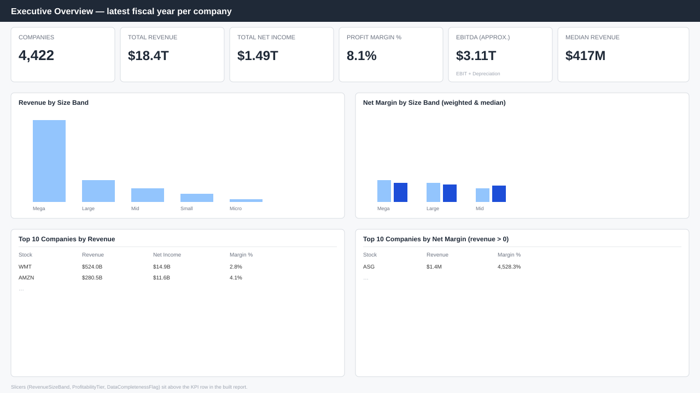

# Public Company Financial Intelligence Dashboard

A Power BI financial-intelligence solution built from the reported income statements, balance sheets and cash-flow statements of **4,422 public companies (2012–2020)**. It answers, from the raw statements alone, how large and profitable the company universe is, how companies compare against same-size peers, which companies look financially unusual, and how a single company's financials evolve over its available fiscal years.

## Overview

Most portfolio BI projects assume a clean, richly-labelled dataset — company name, sector, market cap, all present and correct. This one does not: the source Kaggle dataset is six raw financial-statement extracts keyed only by ticker and filing date, with no sector, geography, market data or headcount field at all. That gap was the first finding of this project (documented in full in [`docs/DATASET_AUDIT.md`](docs/DATASET_AUDIT.md)), and the whole solution was designed around it rather than around it being assumed away.

Instead of a sector-benchmarking dashboard the data cannot support, this project builds **peer cohorts directly from the financials** — revenue-size quintiles and profitability tiers computed in Python — and uses those as the comparison basis throughout. Every KPI, chart and claim in this repository traces to a column that was actually verified present in the source data; nothing about sector, geography, market capitalisation or "real-time" data is implied anywhere.

## Objective

Give an analyst three things from statement data alone: (1) a fast read on the size and health of the company universe, (2) a way to benchmark one company against comparably-sized peers, and (3) a transparent, IQR-based way to surface financially unusual companies without automatically labelling them "bad."

## Dataset

[**Financial Data of 4400 Public Companies**](https://www.kaggle.com/datasets/qks1lver/financial-data-of-4400-public-companies) by `qks1lver` on Kaggle. This project does not own or redistribute the source data — see [`data/raw/README.md`](data/raw/README.md) for how to obtain it. Six CSV files (annual and quarterly income statement, balance sheet, cash flow), 17,511 annual and 17,651 quarterly company-period rows, files dated 14 Jun 2020.

## Tech stack

- **Power BI** (Power Query, data modelling, DAX, report design) — see [`powerbi/README.md`](powerbi/README.md) for the manual build steps and current status
- **Python** (pandas, numpy) — dataset audit and reproducible cleaning/modelling pipeline
- **SQL** — reference queries mirroring the DAX logic, for portability ([`sql/analysis_queries.sql`](sql/analysis_queries.sql); no live database is part of this project)
- **Git/GitHub** — version control and documentation

## Dashboard

The Power BI report itself is a manual build in Power BI Desktop (see [Project status](#project-status-what-is-and-isnt-done) below); screenshots will be added here once it exists. In the meantime, the intended Page 1 layout is in [`docs/dashboard_wireframe_page1.svg`](docs/dashboard_wireframe_page1.svg):



Planned pages (full spec in [`docs/DASHBOARD_DESIGN.md`](docs/DASHBOARD_DESIGN.md)):

1. **Executive Overview** — universe size, aggregate/median revenue & profitability, largest companies, revenue-by-size-cohort.
2. **Peer & Cohort Analysis** — revenue-vs-profitability scatter, cohort ranking, peer benchmark table.
3. **Financial Health & Outliers** — profitability-vs-leverage screen, liabilities-vs-assets check, transparent 3×IQR outlier flagging.
4. **Company Deep Dive** — a selected company's multi-year trend, quarterly trend, and variance from its peer cohort, reached via drill-through.

## Key features (implemented in the design, pending manual Power BI build)

- Interactive KPI cards driven by DAX measures with `DIVIDE()`-safe ratios ([`docs/DAX_MEASURES.md`](docs/DAX_MEASURES.md))
- Peer-cohort benchmarking (size band / profitability tier) with variance-from-peer-median measures
- Transparent, documented outlier logic (3×IQR fences), not a black-box flag
- Drill-through from any company table to a full Company Deep Dive page
- Slicers for revenue-size band, profitability tier and data-completeness

## Data model

A small star schema: two fact tables at different grains (`Fact_Annual`, `Fact_Quarterly`) sharing one `Dim_Company` and one `Dim_Date`, all single-direction relationships. Full rationale — including why year-over-year growth uses a per-company fiscal-period index instead of standard Power BI time-intelligence (fiscal year-ends are not aligned across companies) — is in [`docs/DATA_MODEL.md`](docs/DATA_MODEL.md).


## DAX (representative measures)

```DAX
Total Revenue =
SUM ( Fact_Annual[TotalRevenue] )

Profit Margin % =
DIVIDE ( [Total Net Income], [Total Revenue] )

Return on Equity % =
DIVIDE ( [Total Net Income], CALCULATE ( [Total Equity], Fact_Annual[TotalEquity] > 0 ) )
-- blank when equity <= 0 (1,410 annual rows) — see docs/DAX_MEASURES.md

Peer Median Net Margin % =
CALCULATE (
    [Median Company Net Margin %],
    ALLSELECTED ( Fact_Annual[Stock] ),
    VALUES ( Dim_Company[RevenueSizeBand] )
)
```

All 20+ measures, with business meaning, assumptions and edge cases for each, are in [`docs/DAX_MEASURES.md`](docs/DAX_MEASURES.md).

## Business insights (validated against the data)

- The top revenue-size quintile (836 of 4,422 companies) accounts for **89.0%** of aggregate latest-fiscal-year revenue.
- Median year-over-year revenue growth across companies with a prior fiscal year on record is **+4.8%**.
- The correlation between company size (log revenue) and net margin is a weak **+0.20** — size only weakly predicts profitability in this dataset.
- The highest single net margins in the dataset belong to small, revenue-light entities (e.g. closed-end funds) where a tiny revenue line sits next to a much larger net income — flagged as a scale effect, not "best performance."

Full write-up, with every insight labelled as an observed fact, a calculated metric, or an interpretation, is in [`docs/KEY_INSIGHTS.md`](docs/KEY_INSIGHTS.md).

## Project architecture

```text
public-company-financial-intelligence/
├── README.md
├── requirements.txt
├── .gitignore
├── data/
│   ├── raw/            # not committed — see data/raw/README.md to obtain it
│   └── processed/      # fact_annual.csv, fact_quarterly.csv, dim_company.csv
├── docs/
│   ├── DATASET_AUDIT.md
│   ├── BUSINESS_REQUIREMENTS.md
│   ├── DATA_DICTIONARY.md
│   ├── DATA_MODEL.md (+ data_model_diagram.svg)
│   ├── DAX_MEASURES.md
│   ├── DASHBOARD_DESIGN.md (+ dashboard_wireframe_page1.svg)
│   ├── KEY_INSIGHTS.md
│   └── audit_output.md      # raw, unedited output of python/data_audit.py
├── powerbi/
│   └── README.md        # manual Power BI Desktop build steps + status
├── python/
│   ├── data_audit.py     # Phase 1: read-only dataset audit
│   └── data_validation.py # Phase 3: cleaning + star-schema build
├── sql/
│   └── analysis_queries.sql   # reference queries mirroring the DAX logic
└── screenshots/
    └── README.md         # pending — see powerbi/README.md
```

## Limitations

- **No sector, industry, geography, market cap, share price or employee count** — the source data does not include them; every "peer" reference in this project is a size/profitability cohort computed from the financials, not an industry classification.
- **Static extract**, files dated 14 Jun 2020 — the dashboard does not claim to be real-time and is not connected to a live data source.
- **At most 4 annual and 4 quarterly periods per company** — supports year-over-year growth, not a multi-year CAGR or long-run trend.
- **Fiscal year-ends are not calendar-aligned** across companies (~79% end in December, the rest do not); growth measures use a per-company fiscal index for this reason (see [`docs/DATA_MODEL.md`](docs/DATA_MODEL.md)).
- **Currency is unstated** in the source files; figures are treated as a single reporting currency, which is an assumption, not a verified fact.
- **Balance-sheet identity (Assets = Liabilities + Equity) does not hold within 1% for ~10% of annual rows** — reported as-is, not corrected, per [`docs/DATASET_AUDIT.md`](docs/DATASET_AUDIT.md).
- **Survivorship**: only companies with filings through the 2020 extract date are present; nothing is claimed about companies not in the dataset.

## Future improvements

*(explicitly not implemented — listed as possible future work only)*

- Automated data refresh from a newer dataset export
- Live financial-data API integration for market cap, price and true real-time figures
- External sector/industry enrichment (with an explicit, documented mapping and its own caveats)
- Longer historical trend analysis once more periods are available
- Forecasting and anomaly detection
- Natural-language Q&A over the model
- AI-generated financial summaries per company

## Project status: what is and isn't done

| Phase | Status |
|---|---|
| Dataset audit | ✅ [`docs/DATASET_AUDIT.md`](docs/DATASET_AUDIT.md), [`docs/audit_output.md`](docs/audit_output.md) |
| Business requirements | ✅ [`docs/BUSINESS_REQUIREMENTS.md`](docs/BUSINESS_REQUIREMENTS.md) |
| Data cleaning / star-schema build | ✅ [`python/data_validation.py`](python/data_validation.py) → `data/processed/*.csv` |
| Data dictionary | ✅ [`docs/DATA_DICTIONARY.md`](docs/DATA_DICTIONARY.md) |
| Data model design + diagram | ✅ [`docs/DATA_MODEL.md`](docs/DATA_MODEL.md) |
| DAX measure definitions | ✅ [`docs/DAX_MEASURES.md`](docs/DAX_MEASURES.md) |
| Dashboard specification + wireframe | ✅ [`docs/DASHBOARD_DESIGN.md`](docs/DASHBOARD_DESIGN.md) |
| Validated business insights | ✅ [`docs/KEY_INSIGHTS.md`](docs/KEY_INSIGHTS.md) |
| SQL reference queries | ✅ [`sql/analysis_queries.sql`](sql/analysis_queries.sql) |
| **Power BI `.pbix` report** | ❌ **Not built** — requires Power BI Desktop, which this environment does not have. Manual build steps: [`powerbi/README.md`](powerbi/README.md) |
| Screenshots | ❌ Pending the `.pbix` build |
| Resume bullets | ❌ Intentionally deferred until the `.pbix` exists and its claims are verifiable — see [Resume alignment](#resume-alignment-not-written-yet) |

### What you still need to do manually

1. Install Power BI Desktop (Windows, or via the web/Fabric equivalent).
2. Download the source dataset into `data/raw/` (see [`data/raw/README.md`](data/raw/README.md)).
3. Run `pip install -r requirements.txt` then `python python/data_audit.py` and `python python/data_validation.py` to (re)generate `data/processed/*.csv` — already run once to produce the files in this repo, but rerun if you re-download the source.
4. Follow [`powerbi/README.md`](powerbi/README.md) step by step to build the model, measures and 4 report pages.
5. Export screenshots into `screenshots/` and this README will render them automatically once added.

### Resume alignment (not written yet)

Per the working rules for this project, resume bullets are written only after the `.pbix` exists and its claims (row counts, KPI values, features actually built) can be verified against it — not before. Once built, bullets will draw only on what Sections above already state is implemented.
